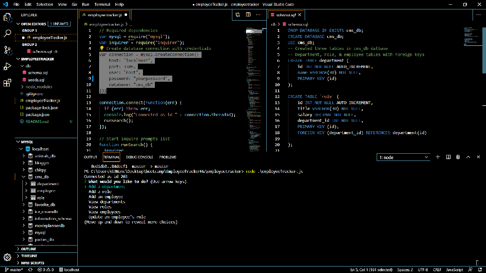

# Employee Tracker

An application solution for managing a company's employees using node, inquirer, and MySQL often known as Content Management Systems interfaces.

The database schema contains three tables:

* **department**:

  * **id** - INT PRIMARY KEY
  * **name** - VARCHAR(30) to hold department name

* **role**:

  * **id** - INT PRIMARY KEY
  * **title** -  VARCHAR(30) to hold role title
  * **salary** -  DECIMAL to hold role salary
  * **department_id** -  INT to hold reference to department role belongs to

* **employee**:

  * **id** - INT PRIMARY KEY
  * **first_name** - VARCHAR(30) to hold employee first name
  * **last_name** - VARCHAR(30) to hold employee last name
  * **role_id** - INT to hold reference to role employee has
  * **manager_id** - INT to hold reference to another employee that manager of the current employee. This field may be null if the employee has no manager

## User Story

As a business owner
I want to be able to view and manage the departments, roles, and employees in my company
So that I can organize and plan my business

## Installation

Run following commands for dependencies installations:

```sh
npm install
```
Install MySQL server, MySQL Workbench (or other visual database design tool) on your local computer. 

Enter your credentials on the employeeTracker.js file.

Run MySQL query (schema.sql) to create your database.

## Usage
  
A command-line application that allows the user to:

  * Add departments, roles, employees

  * View departments, roles, employees

  * Update employee roles
  
  * Deletes employees

Run the following commands for execution of application:
 
```sh
node employeeTracker.js
``` 
Questions will be prompted to user in command line and make changes to tables as necessary.

